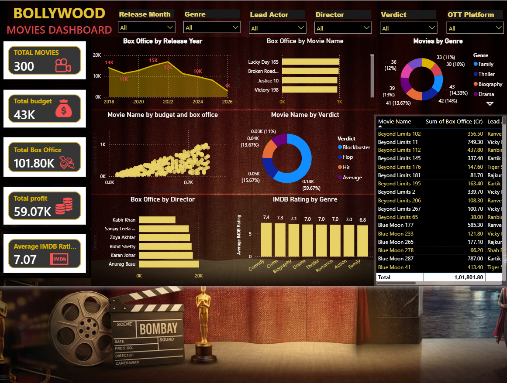

# 🎬 Bollywood Power BI Dashboard

An interactive Power BI dashboard analyzing Bollywood movie data using KPIs, charts, maps, and slicers to provide valuable business insights.

## 📸 Dashboard Preview

---

## 📌 Project Overview

This dashboard provides an interactive analysis of Bollywood movies, helping users explore trends in ratings, revenue, genres, release years, and overall movie performance.

---

## 🚀 Features

- Interactive slicers
- KPI Cards
- Revenue Analysis
- Rating Analysis
- Genre Distribution
- Year-wise Movie Trends
- Clean & Modern Dashboard Design

---

## 🛠 Tools & Technologies

- Microsoft Power BI
- Power Query
- DAX

---

## 📂 Repository Contents

- `Bollywood-PowerBI-Dashboard.pbix` – Power BI dashboard
- `Bollywood_Movies_Dataset_PowerBI.xlsx` – Dataset
- `Dashboard-preview.png` – Dashboard preview

---

## 📈 Key Insights

- Compare movie ratings.
- Analyze revenue trends.
- Identify top-performing genres.
- Explore movie performance over time.

---
## 📊 Dashboard KPIs

- Total Movies
- Total Budget
- Total Box Office
- Total Profit
- Average IMDb Rating

   ## 📈 Dashboard Visualizations

- Revenue Trend by Year
- Movies by Genre
- IMDb Rating by Genre
- Box Office by Director
- Budget vs Box Office
- Movie Performance Table
  
## ⭐ Skills Demonstrated

- Data Cleaning
- Data Modeling
- DAX Calculations
- Power Query
- Data Visualization
- Dashboard Design

## 👨‍💻 Author

**Sakib Saifi**

GitHub: https://github.com/SAKIBSAIFI-HUB
